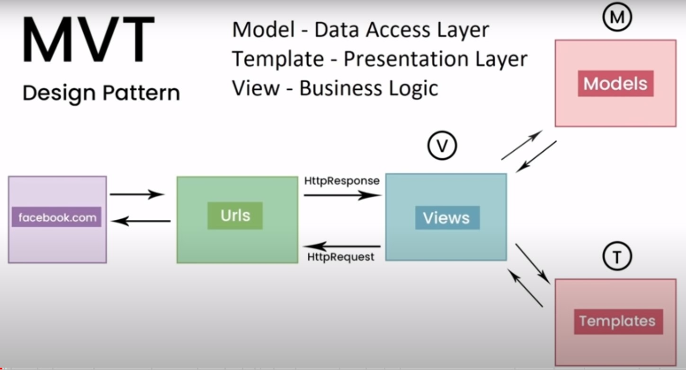
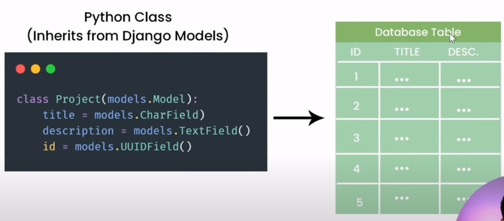
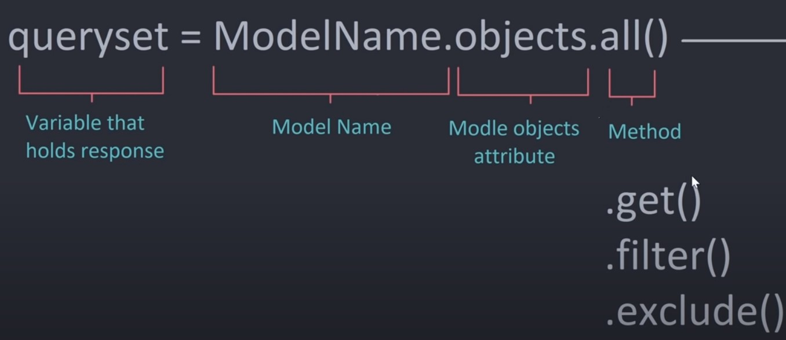

# Django Full Course

<https://www.youtube.com/watch?v=PtQiiknWUcI&t=4994s>

[MVT Design Pattern](#MVT-Design-Pattern)

[Creating Django App](#Creating-Django-App)

[Install, Activate Virtual Environment](#Install-Activate-Virtual-Environment)

# MVT Design Pattern

django follows a MVT design pattern



- model - databases, tables.

- template - html pages.

- view - when user enter a url, request goes to view and view returns response in form of templates or get data from models.

# Install, Activate Virtual Environment

```bash
pip install virtualenv
```

```bash
Home@DESKTOP-NBDEUNF MINGW64 /f/complete-django-course/django-course-env
$ source Scripts/activate
```

> **db.sqlite3**: The database created when you ran the migrate command;

> **manage.py**. A command-line utility for executing Django commands from within your project.

> **settings.py**. The settings file for your project.

> **urls.py**. The URL configuration for your project.

> **wsgi.py**. The WSGI application for your Django project.

> \***\*init**.py**. The**init\*\*.py file for your project.

> \***\*pycache\*\***. The **pycache** directory for your project.

> When we create new app, it is added to INSTALLED_APPS list in settings.py.

# Creating Django App

- navigate to project directory.

```bash
python manage.py startapp <app_name>
```

- Add this app to INSTALLED*APPS in \_settings.py*

```bash
INSTALLED_APPS = [
    'base.apps.BaseConfig'
    'django.contrib.admin',
    'django.contrib.auth',
    'django.contrib.contenttypes',
    'django.contrib.sessions',
    'django.contrib.messages',
    'django.contrib.staticfiles',
]
```

- we added base app to INSTALLED_APPS list.
- nwow django knows that we have created a new app.
- **BaseConfig** is the class name of the app. It is given in the apps.py file.

> **apps.py**: The apps.py file for your project.

> **models.py**: The models.py file for your project.

> **views.py**: The views.py file for your project. All views are defined here.

## Creating Views

**views.py**

```py
from django.http import HttpResponse

# Create your views here.


def index(request):
    return HttpResponse("<h3>Hello, world. You're at the base index</h3>")

```

- add url configuring in urls.py
- create a urls.py file in app directory.

**urls.py**

```py
from django.urls import path
from . import views

urlpatterns = [
    path('index/', views.index, name='index'),
]

```

- Configure our app's urls in urls.py file in project directory.

**urls.py**

```py
urlpatterns = [
    path('admin/', admin.site.urls),
    path('', home),
    path('', include('base.urls')),
]

```

- Then navigate to browser and enter url: <http://127.0.0.8000/index/>

## Creating Templates

- Create a templates directory in project root directory. Here root it studybud-main folder.
- Create html files in templates directory.
- Then configure templates folder in settings.py in DIRS list.

```PY
    'DIRS': [BASE_DIR / 'templates'],
```

- Django now knows that we have created a new templates folder.

- Now we render the template in views.py.

**views.py**

```py
def home(request):
    return render(request, 'home.html')

def room(request):
    return render(request, 'rooms.html')
```

## Template Inheritance

- Suppose we want to show a navbar in every page of our app.
- We can create a main template and include the navbar template there.
- Then we can extend that main template to every other templates in our app to show navbar

- First Create a navbar.html file in templates directory.
  - add content to navbar.html file.
- Then create a main.html file in templates directory.

  - include the navbar.html file in main.html file.

  ```html
  <body>
      
  </body>
  ```

- Now extend this main.html file to every other templates in our app.

  - Wrap the content in content block.

  ```html
   

  <h1>Home Page</h1>

  
  ```

## Passing Data to Templates

- Create a dictionary of rooms in views.py.
- Pass it to context dictionary in function that we want to pass.
- Pass dictionary to render function.
- In template we can access the data using {{}}.

```html
<div>
  
  <div>
    <h3>{{ room.id }} - {{room.name}}</h3>
  </div>
  
</div>
```

- Create a separate templates directory for each apps.
- With in templates directory create a folder with app name.
- Create templates in that folder which is specific to that app.
- Remove app specific templates from templates folder under root directory.
  - Only keep template that is common to all apps.
- Update template path in views.py file.

**views.py**

```py
def home(request):
    context = {
        'rooms': rooms
    }
    return render(request, 'base/home.html', context)

def room(request):
    return render(request, 'base/rooms.html')
```

## Dynamic URL Routing

- When we click on each room it should redirect to room detail page.
- We can use dynamic url routing.
- we can do it by adding a parameter called pk (primary key) to our url.
- check below url in urls.py file.

```py
    path('room/<str:pk>', views.room, name='room'),

```

- Pass new parameter to room function.

```py
def room(request, pk):
    return render(request, 'base/rooms.html')
```

- Now we have access to room id parameter in room function.
- Render that room id parameter in href of room name.

```html
<h3>{{ room.id }} - <a href="/room/{{room.id}}">{{room.name}}</a></h3>
```

- So by clicking on room it will redirect to room detail page.
- Url on browser is <http://127.0.0.8000/room/1>.

## Updating Details Page

- Update room function in views.py.

```py
def room(request, pk):
    room = None
    for r in rooms:
        if r['id'] == int(pk):
            room = r
            break
    context = {'room': room}
    return render(request, 'base/rooms.html', context)

```

- Loop thru each room in rooms list.
- if room id matches with pk then that room dictionary is assigned to room variable.
- Store them in context dictionary.
- Context dictionary looks like below if there is a match

```bash
{'room': {'id': 2, 'name': "Let's learn machine learning"}}
```

- Pass the same to render function.
- Next, Update the room detail page.

```html
<h3>{{ room.name }}</h3>
```

- So on clicking on room name it will redirect to room detail page.

## Setting Up Dynamic Urls

- Use built in url tag to replace static url.
- Pass url name in quotes, pass parameters like id to the url tag.

```html
<a href="">{{ room.name }}</a>
```

## Database and Admin Panel

- Run below command in terminal to create database.

```bash
python manage.py migrate
```

- Next create database tables in models.py file.
- Demo image



- As it seen in image, Project will be the table name.
- title, description, id is the column name.
- id is primary key.

**models.py**

```py
class Room(models.Model):
    name = models.CharField(max_length=128)
    description = models.TextField(null=True, blank=True)
    updated = models.DateField(auto_now=True)
    created = models.DateField(auto_now_add=True)
    def __str__(self):
        return self.name
```

- Database Table - Room
- Columns - name, description, updated, created
- auto_now=True - update the timestamp everytime we update data.
- auto_now_add=True - Set timestamp once we add the data. Not update the timestamp everytime we make changes.

- Now we define our models, Next run the migrations to create the model using below command.

```bash
python manage.py makemigrations
```

- Created model called Room.
- This command should run everytime we make changes in models.py file.
- We can see the related changes in _migrations\0001_initial.py_ file.
- Next run below command to apply the migrations.

```bash
python manage.py migrate
```

- Now we can see the table Room in database.

### Generating Admin Users

```bash
python manage.py createsuperuser
```

- Now we created a user.
- Next login to admin panel, <http://127.0.0.8000/admin/>
- To view our model there, register our model with admin panel in admin.py.

**admin.py**

```py
from .models import *

admin.site.register(Room)
```

- Now refresh site we can view our model there.
- Add Rooms to our admin panel.

### Getting Rooms from database to our template

```py
from .models import Room

def home(request):
    rooms = Room.objects.all()
    context = {
        'rooms': rooms
    }
    return render(request, 'base/home.html', context)

```

- Import model Room from models.py.
- Access all objects from Room model using _Room.objects.all()_ method.
- Render the rooms in home.html file.
- Now we can see rooms created in database on our home page.

## Model manager



- Now apply the same method for Room details page.

```py
def room(request, pk):
    room = Room.objects.get(pk=pk)
    context = {'room': room}
    print(context)
    return render(request, 'base/rooms.html', context)
```

- Use _Room.objects.get(pk=pk)_ method to get the specific room object.
- Render that room in rooms.html file.
- Context dictionary looks like below.

```bash
{'room': <Room: Django Devs>}
{'room': <Room: Let's learn React>}
```

- Now on click each room name it shows content specific to that room.

Time: 1:24:45
